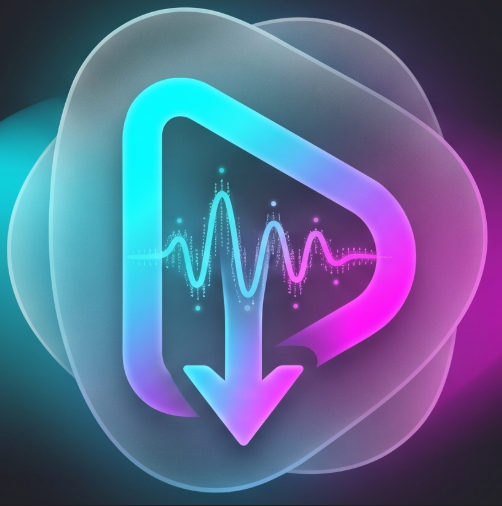

<div align="center">



# 🎧 Aether Player

**Reproductor de música multiplataforma hecho con Flutter**

Buscá canciones y videos, armá tu biblioteca y playlists, mirá letras sincronizadas en modo karaoke,
y escuchá todo sin conexión — usando YouTube / YouTube Music como fuente de contenido.

[](../../releases)
[](../../releases)
[](LICENSE)
[](https://flutter.dev)
[](#-descargar)

</div>

---

## 📑 Tabla de contenidos

- [Características](#-características)
- [Tecnologías](#-tecnologías)
- [Descargar](#-descargar)
- [Compilar desde el código fuente](#-compilar-desde-el-código-fuente)
- [Historial de versiones](#-historial-de-versiones)
- [Reportar un problema o sugerir algo](#-reportar-un-problema-o-sugerir-algo)
- [Aviso legal](#-aviso-legal)
- [Licencia](#-licencia)

## ✨ Características

| | |
|---|---|
| 🔎 **Explorar** | Búsqueda de música y videos (YouTube Music), con vista previa antes de descargar y búsqueda de álbumes completos. |
| ⬇️ **Descargas** | Audio en MP3 y video en varias calidades, para escuchar/ver sin conexión. |
| 📚 **Biblioteca** | Playlists propias, favoritos, y opción de ocultar o eliminar canciones. |
| 🎤 **Karaoke** | Letras sincronizadas en tiempo real con la canción. |
| ▶️ **Reproductor** | Mini-player con barra de progreso + vista completa, reproducción en segundo plano. |
| 🖼️ **Portadas** | Extracción automática de metadatos y carátulas, con paleta de colores dinámica según el álbum. |
| 🎬 **Videos locales** | Pestaña dedicada en la Biblioteca para tus videos descargados. |

## 🛠️ Tecnologías

<div align="left">


</div>

- [Flutter](https://flutter.dev) / Dart
- `just_audio` + `just_audio_background` para la reproducción
- `youtube_explode_dart` y `dart_ytmusic_api` para obtener el contenido
- `sqflite` para almacenamiento local
- `provider` para el manejo de estado
- `cached_network_image` para el caché de portadas/miniaturas

## 📲 Descargar

La APK para Android está disponible en la sección [**Releases**](../../releases) de este repositorio.

> No se distribuye la app compilada dentro del código fuente del repositorio para no inflar su tamaño; cada versión se publica como adjunto en un *Release*.

## 🧑‍💻 Compilar desde el código fuente

Requiere tener el [SDK de Flutter](https://docs.flutter.dev/get-started/install) instalado.

```bash
git clone https://github.com/NekoCoder-en/Aehter.git
cd Aehter
flutter pub get
flutter run            # ejecutar en un dispositivo/emulador conectado
flutter build apk      # generar la APK de release
```

## 🗓️ Historial de versiones

### `v1.1.0` (actual)
- **Explorar**: vista previa (audio) de canciones y videos antes de descargar; descarga de video con selector de calidad, además del audio en MP3; búsqueda de álbumes reactivada; feedback visual de error en descargas con reintento.
- **Biblioteca / Inicio**: eliminar una canción ahora la borra permanentemente (ya no queda en "ocultas"); "Actualizar portadas" también corrige artista/título vía YouTube Music; fix de miniaturas de video que se recargaban al volver de reproducir un video.
- **Reproductor**: rediseño de la hoja de opciones (accesos rápidos, fotos de artista más confiables) y barra de progreso en el mini-player.
- **General**: notificaciones propias (reemplazan los avisos por defecto), caché de imágenes de red y menor consumo al descargar en segundo plano.

### `v1.0.0`
- Versión inicial: búsqueda y reproducción de música vía YouTube Music, descarga de audio, biblioteca y playlists, letras sincronizadas / karaoke, mini-player y reproductor completo.

## 🐛 Reportar un problema o sugerir algo

¿Encontraste un bug o tenés una idea? [Abrí un issue](../../issues/new). Se organizan con estas etiquetas:

| Etiqueta | Significado |
|---|---|
| 🐞 `bug` | Algo no está funcionando |
| 📘 `documentation` | Mejoras o agregados a la documentación |
| 🔁 `duplicate` | Este issue o pull request ya existe |
| 🚀 `enhancement` | Una funcionalidad o pedido nuevo |
| 🌱 `good first issue` | Buen punto de entrada para nuevos colaboradores |
| 🙋 `help wanted` | Se necesita una mano extra |
| ❌ `invalid` | Esto no parece correcto |
| ❓ `question` | Se necesita más información |
| 🚫 `wontfix` | No se va a resolver |

## ⚖️ Aviso legal

Este proyecto es un ejercicio personal/educativo de desarrollo con Flutter. No está afiliado, respaldado ni patrocinado por YouTube, YouTube Music ni Google.

La descarga de contenido protegido por derechos de autor sin permiso puede infringir los [Términos de Servicio de YouTube](https://www.youtube.com/t/terms) y la legislación de propiedad intelectual aplicable en tu país. El uso de esta aplicación es responsabilidad exclusiva de quien la ejecuta; los autores no se hacen responsables del uso que se le dé.

## 📄 Licencia

Este proyecto se distribuye bajo la licencia [MIT](LICENSE).

<div align="center">

Hecho con 💙 y Flutter

</div>
